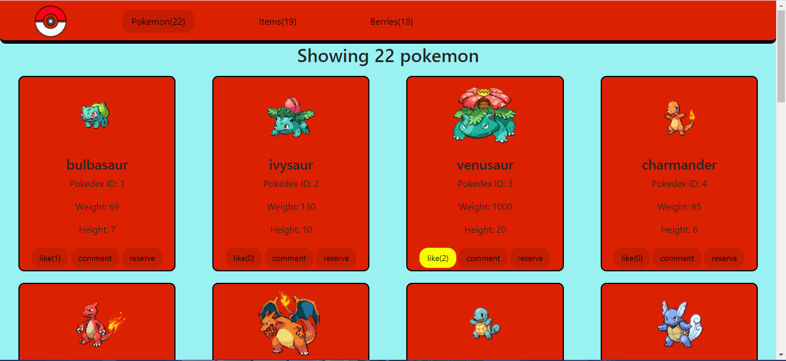

# JavaScript PokePage

> This project is our final Capstone for the JavaScript module at Microverse. Hop in and visualize, comment, like, and reserve pokemon, items and berries from the amazing world of Pokemon.

[Click here to see a video presentation of this project](https://drive.google.com/file/d/17LulSfMXaTSwENSR0oelLcz7pxRMSSEj/view?usp=sharing).




## Built With

- Major languages
    - JavaScript
    - HTML and CSS

- Frameworks
    - Webpack
    - Bootstrap
    - Jest

- Technologies used
    - NodeJS CLI
    - Visual Studio Code
    - [PokeAPI](https://pokeapi.co/)
    - Microverse Involvement API

## Getting Started

### Prerequisites

- Install a code editor(VSCode or Atom will do the trick)
- Install NodeJS
- Install Git Bash

### Setup

- In a folder of your choice, clone this repo using ```git clone https://github.com/DanteAlonsoHT/JavaScript-Capstone.git``` in your git bash.
- ```cd JavaScript-Capstone``` and then ```code .``` or ```atom .``` depending on your editor to open the project

### Install

- In your integrated command line, ```npm install``` to install all node dependencies

### Usage

- In your integrated command line, ```npm start``` will launch the website on your default browser.
- Now enjoy! You can make comments or reservations, and express yourself liking any list element!

### Run tests

- To run the test using JEST, run the next command in your terminal: ```npm test```

## Authors

👤 **Dante Alonso**

- GitHub: [@DanteAlonsoHT](https://github.com/DanteAlonsoHT)
- Twitter: [@dante_dante1](https://twitter.com/dante_dante1)
- LinkedIn: [Dante Alonso](https://www.linkedin.com/in/dante-alonso/)

👤 **Yuvraj Manoo**

- GitHub: [@YuvrajjM108](https://github.com/YuvrajM108)
- Twitter: [@YuvrajM108](https://twitter.com/YuvrajM108)
- LinkedIn: [Yuvraj-Manoo](https://linkedin.com/in/yuvraj-manoo)

👤 **Julian Carracedo**

- GitHub: [@JuliCarracedo](https://github.com/JuliCarracedo)
- Twitter: [@CarracedoTrigo](https://twitter.com/CarracedoTrigo)
- LinkedIn: [Julian Carracedo](https://linkedin.com/in/julian-carracedo)

## 🤝 Contributing

Contributions, issues, and feature requests are welcome!

## Show your support

Give a ⭐️ if you like this project!

## 📝 License

This project is [MIT](./MIT.md) licensed.
